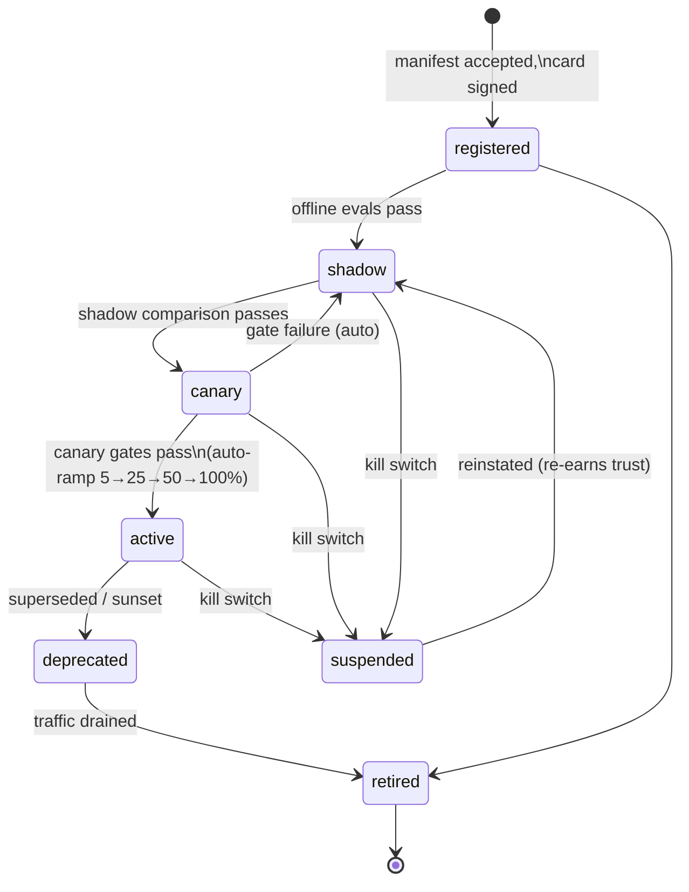

# Agent Lifecycle

Agents join, serve, and leave the platform **dynamically** — no platform
redeploy to add or remove an agent. The lifecycle is the backbone of
governance: an agent's state determines what traffic it may receive, and
every state transition is gated, audited, and reversible.

## The Agent Record

The Registry stores a superset of an A2A-compatible agent card:

```yaml
# Capability manifest (authored by the agent team, versioned in git)
id: netsec-agent
name: Network Security Agent
owner: team-netsec            # accountable humans — required
description: >
  Read-and-explain over the network security estate.
capabilities:
  - name: netsec.exposure_analysis
    risk: R0                  # R0 read | R1 draft | R2 write-gated | R3 write-auto
    input_schema: {...}       # JSON Schema 2020-12
    output_schema: {...}
    examples: [...]           # used for semantic matching and evals
tools:                        # MCP servers this agent may bind
  - server: firewall-mgr
    scopes: [rules:read]
models:
  allowed: [default-tier]     # model classes, not hard-coded model IDs
data_classification: confidential
sla: {p95_latency_s: 30, quality_slo: 0.90}
```

Platform-managed fields added at registration: `version` (semver on the
capability contract), `lifecycle_state`, `eval_baseline`, `deployed_at`,
`card_signature` (JWS — cards are signed so consumers can verify provenance,
per A2A v1.0 practice).

**Versioning rule:** semver applies to the **capability contract**, not the
implementation. Prompt or model changes that preserve schemas are minor/patch
— but still require passing eval gates. Schema-breaking changes are major and
require a deprecation window during which both versions serve.

## Lifecycle States



| State | May receive | Entry gate |
|---|---|---|
| `registered` | nothing (validation only) | manifest schema valid, owner assigned, card signed, eval suite present |
| `shadow` | mirrored traffic, **side effects suppressed** | offline eval ≥ baseline on golden set; red-team suite passed |
| `canary` | small live fraction (session-pinned) | shadow diff vs incumbent within tolerance for the soak window |
| `active` | full routed traffic | canary quality/cost/latency gates passed at each ramp step |
| `deprecated` | existing sessions only | replacement active, deprecation window announced |
| `suspended` | nothing | kill switch — immediate, any prior state |
| `retired` | nothing | traffic drained; record kept for audit |

### Shadow mode

The Deployment Controller mirrors real requests to the shadow version with a
shared correlation ID. The platform — not the agent — suppresses side
effects: the tool gateway executes R0 tool calls normally but stubs R1+ calls
and records what *would* have been done. Shadow and incumbent outputs are
scored on the same judge rubric for paired comparison
(see [evaluation.md](evaluation.md)).

### Canary

Live traffic percentage routed by the orchestrator's registry lookup, with
**session pinning** — a multi-turn task never switches agent versions
mid-flight. Promotion gates evaluate quality score, task success rate,
escalation rate, p95 latency, and cost per task against the incumbent.
Breach of any gate auto-rolls back to the previous ramp step and alerts the
owning team; two consecutive rollbacks demote to `shadow`.

### Deployment Controller v0 (Phase 3 item 4 — implemented)

The `DeploymentWorkflow` owns promotion end-to-end: it transitions the
candidate through `shadow → canary` ramp → owner approval (R2+ only) →
atomic `/promote` → drain, gating each phase on the deterministic
`GateEvaluator` (evaluation.md). The registry is now **versioned** — one card
per `(agent_id, version)`, with DB-enforced one-active / one-candidate
invariants — so a candidate's card and `eval_baseline` are unclobberable
(closes debt #3). Routing is version-aware with a deterministic session bucket
(`sha256(task_id) % 100`); a canary task stays on one version end-to-end, and a
compensator is pinned to the exact version that did the write.

v0 deviations (deliberate, documented):
- **`shadow → retired`** is a legal admin edge (candidate cleanup without a
  promote), and **`suspended → active`** is kept as a legacy admin edge so the
  kill-switch reinstatement path works without routing through `shadow`.
- **Suspension is coarse**: the kill-switch flag is keyed by the whole agent id
  (`killswitch.agent.{id}`), suspending all versions at once — acceptable
  emergency control; per-version suspension is deferred.
- **Owner approval** records the initiator but does not yet verify approver ∈
  owner team (no directory); the true-traffic drain is a fixed timer, and
  gated (R2) capabilities are **not** shadow-mirrored in v0.

### Kill switch

Tiered, tested, and owned:

1. **Agent** — suspend one agent version (registry state → `suspended`;
   routers observe the NATS registry event within seconds; in-flight Temporal
   workflows receive a cancellation signal and run compensation).
2. **Capability** — disable one capability platform-wide (e.g., all R2
   writes) via policy flag, without touching agents.
3. **Fleet** — halt all agent dispatch; the orchestrator queues or rejects
   new tasks.

Each tier has a named owner and a runbook, requires no vendor involvement,
and is exercised quarterly (game days). Every activation is itself an audit
event.

**Kill-switch mid-task delivery (v1, Phase 3 item 2).** Suspending an agent
(`scripts/kill-switch.mjs suspend <id>`) does NOT by itself signal running
Temporal workflows. Two mechanisms cover in-flight tasks:

1. **Auto-unwind via discovery.** Every step re-discovers its agent at dispatch
   time, and a suspended agent is not `active`, so the *next* step of any
   in-flight task fails — which fires the compensation trigger and unwinds the
   writes already completed (the main payoff, with zero new delivery
   machinery). A task blocked on an approval or a long activity is not
   interrupted until its next dispatch.
2. **Explicit cancel** for tasks that must stop *now*:
   `POST /v1/tasks/:task_id/cancel` (scope `task:submit`, tenant-scoped;
   emits `task.cancel_requested`). The workflow drains the in-flight wave,
   unwinds the compensation stack, and returns status `cancelled`.

**Runbook — suspend an agent with in-flight write tasks:**
1. `scripts/kill-switch.mjs suspend <agent-id> --reason "<why>"` — flips the
   registry flag; new dispatch to that agent stops within seconds.
2. Identify in-flight tasks touching the agent (audit stream: `step.dispatched`
   for the agent with no terminal `task.completed`). A fleet task→agent index
   for automatic routing arrives with item 5; until then this is a manual join.
3. For each such task, `POST /v1/tasks/:task_id/cancel` to force the
   drain-then-unwind, or let auto-unwind fire at the next dispatch.
4. Verify each task's terminal `compensation.completed`. A
   `compensation.status: incomplete` means a write remains in effect —
   **if the suspended agent was the only server of the compensator, the unwind
   cannot route through it** (auto-routing a compensator through a just-killed
   agent would contradict the kill switch). Compensate manually per the
   capability's runbook and record it.
5. On `reinstate`, re-run any incomplete compensations.

## Dynamic Registration and Discovery

- **Register:** agent deployment (CI-driven) submits the manifest to the
  Registry; the Registry validates, signs the card, writes Postgres, and
  publishes `registry.agents.<id>.updated` on NATS. Routers and the
  orchestrator maintain a local cache from the NATS KV bucket + event stream.
- **Health:** agents expose liveness via NATS services framework (PING/STATS)
  — but liveness is not fitness. The Evaluation Service runs periodic
  **synthetic probes** (canary prompts with known-good answers) against
  active agents; failing probes demote the agent's routing weight and page
  the owner.
- **Deregister:** TTL-based. An agent that stops heartbeating is removed
  from routing (state unchanged); one that announces shutdown drains
  gracefully.
- **Discovery query:** consumers ask the Registry, never scan the bus:
  structured filters first (capability name, risk class ≤ requested, tenant
  visibility, state = active), then optional semantic ranking over capability
  descriptions/examples. Semantic match is candidate *retrieval*; policy
  filters are the *gate* — an agent the policy engine wouldn't authorize is
  never returned as a candidate.

## Who May Change State

| Transition | Actor | Control |
|---|---|---|
| register | agent team CI | manifest review (2 humans) + schema validation |
| → shadow / canary / ramp | Deployment Controller | automated gates; owner can hold |
| promote to active (final) | Deployment Controller | gates + explicit owner approval for R2-capable agents |
| suspend (kill) | on-call, platform admin, or automated SLO breach | audited, alarmed |
| retire | owner + platform admin | traffic drained check |

## Relationship to Standards

Every agent must be built from the SDK template to enter `registered` — the
template guarantees the manifest, eval suite, telemetry, and structured
logging exist. See [standards/agent-patterns.md](../standards/agent-patterns.md).
