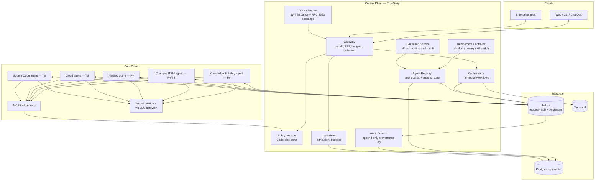

# Architecture Overview

The platform is a **control plane for composable, governed AI agents**. It
separates cleanly into:

- a **control plane** — TypeScript services that govern *how* work happens:
  identity, policy, registry, deployment, orchestration, evaluation, cost,
  audit;
- a **data plane** — the agents themselves (Python or TypeScript workers) and
  the MCP tool servers they call;
- a **substrate** — NATS (messaging, discovery, eventing), Temporal (durable
  workflow execution), and Postgres (+ pgvector) as the system of record.

The key invariant: **agents never talk to tools, models, or each other
directly.** Every hop crosses a platform-controlled boundary (gateway, message
bus, or workflow engine) where identity, policy, telemetry, and cost controls
are enforced. Governance lives in the boundaries, so no agent can opt out.

## System Diagram

## Components

### Control plane (TypeScript)

| Component | Responsibility | Detail |
|---|---|---|
| **Gateway** | Single entry point. Authenticates principals, enforces policy (PEP), injects attribution metadata, applies budgets/rate limits, redacts PII at the boundary. Also fronts MCP tool servers (the "tool gateway" role). | [security.md](security.md), [cost-management.md](cost-management.md) |
| **Token Service** | Issues short-lived stateless JWTs; performs RFC 8693 token exchange so delegation chains (user → orchestrator → agent → tool) are carried in `act` claims. | [security.md](security.md) |
| **Agent Registry** | System of record for agents: capability manifests (A2A-compatible agent cards), versions, lifecycle state, eval scores, ownership. Serves discovery; publishes state changes on NATS. | [agent-lifecycle.md](agent-lifecycle.md), [messaging-and-discovery.md](messaging-and-discovery.md) |
| **Policy Service** | Cedar policy decision point. Every tool call and every agent-to-agent delegation gets an allow / deny / require-approval decision. Default deny. | [governance-and-policy.md](governance-and-policy.md) |
| **Orchestrator** | Temporal workflows (TypeScript) implementing the task lifecycle: decomposition, delegation to agents, approval gates, compensation, timeouts. | [orchestration.md](orchestration.md) |
| **Deployment Controller** | Moves agent versions through shadow → canary → ramp → active; executes promotion gates and automatic rollback; owns the kill switch. | [agent-lifecycle.md](agent-lifecycle.md) |
| **Evaluation Service** | Runs golden-set evals in CI, samples production traffic for LLM-judge scoring, detects drift, feeds promotion gates. | [evaluation.md](evaluation.md) |
| **Cost Meter** | Computes per-span cost from token telemetry; enforces hierarchical budgets; produces showback/chargeback rollups. | [cost-management.md](cost-management.md) |
| **Audit Service** | Consumes the audit event stream into append-only, hash-chained storage; serves provenance queries and replay. | [governance-and-policy.md](governance-and-policy.md) |
| **Knowledge Service** | Shared RAG infrastructure: ingestion pipelines, hybrid search over pgvector. Used by the Knowledge agent and available to all agents. | [knowledge-and-rag.md](knowledge-and-rag.md) |

### Data plane

- **Agents** — long-running workers built on the platform SDK
  (`@acp/agent-sdk` for TypeScript, `acp-agent-sdk` for Python). An agent is:
  a capability manifest + a set of capability handlers + tool bindings + an
  eval suite. Agents receive work as Temporal activities and NATS requests;
  they never expose their own network endpoints.
- **Tool servers** — MCP servers (Streamable HTTP, stateless per the 2026 MCP
  revision) wrapping enterprise systems (ITSM, cloud APIs, firewalls, Git
  forges). Deployed behind the Gateway's tool-gateway role so policy,
  credential brokering, and audit apply to every call.
- **Model access** — all LLM calls go through a single LLM gateway path
  (provider-agnostic client in the SDK) so model routing, prompt caching,
  token accounting, and provider rate limits are centralized.

### Substrate

- **NATS** — core request-reply for RPC-style calls and discovery
  (services framework); JetStream for durable event streams (audit, telemetry
  events, task events); KV for registry cache and feature flags.
  Accounts provide tenant isolation. See [ADR-0001](../adr/0001-nats-messaging-and-discovery.md).
- **Temporal** — durable execution for every multi-step task. Workflows are
  TypeScript (control plane); activities run on Python or TypeScript agent
  workers via language-specific task queues. See [ADR-0002](../adr/0002-temporal-workflow-orchestration.md).
- **Postgres** — one operational database technology: relational state,
  pgvector for retrieval, partitioned audit tables. See [ADR-0003](../adr/0003-pgvector-for-rag.md).

## Request Lifecycle (happy path)

1. A principal (human or service) calls the Gateway with a platform JWT.
2. Gateway authenticates, checks budget, stamps attribution
   (tenant/principal/session), and starts an **Orchestrator workflow** in
   Temporal.
3. The workflow consults the **Agent Registry** for agents whose capabilities
   match the task (structured filter first, semantic match second) and plans
   the composition — either a code-defined workflow for known task shapes or
   an LLM-planned decomposition for open-ended ones.
4. For each delegation, the workflow requests a **scoped token** (RFC 8693
   exchange: audience = target agent, scopes = intersection of principal's
   and agent's permissions) and dispatches the step to the agent's task queue.
5. The agent executes: LLM calls via the model gateway, tool calls via MCP
   through the tool gateway. **Every tool call** is authorized by the Policy
   Service; R2 capabilities suspend the workflow on an approval gate.
6. Every hop emits OTel spans (`gen_ai.*`) and audit events (JetStream);
   the Cost Meter prices token usage at span close.
7. The workflow synthesizes agent results and returns an answer with
   citations, the agent/tool trail, and policy decisions applied.

## Trust Boundaries

| Boundary | Enforced by | Controls |
|---|---|---|
| Client → platform | Gateway | authN, rate limit, budget, input guardrails |
| Workflow → agent | Temporal + Token Service | scoped token, task contract schema |
| Agent → tool | Tool gateway + Policy Service | Cedar decision, credential brokering, output handling |
| Agent → model | LLM gateway | model allowlist, token caps, prompt-injection screening of retrieved content |
| Agent → agent | never direct | must route through orchestrator delegation |
| Everything → audit | JetStream audit stream | append-only, hash-chained |

## What Is Deliberately Boring

Multi-tenancy via NATS accounts + Postgres RLS; JWTs with JWKS rotation;
OpenTelemetry end to end; Docker/Kubernetes deployment; SemVer. The novelty
budget is spent on agent governance — lifecycle, evaluation, and policy —
not on infrastructure.
